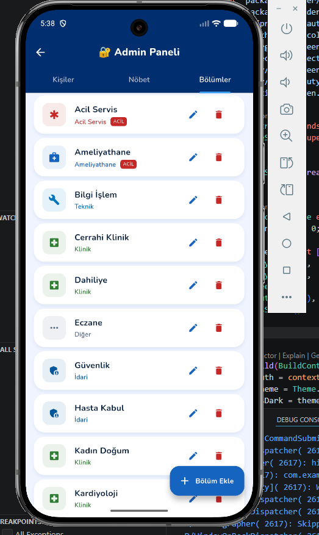

# 🏥 Hastane Rehber ve Nöbet Takip Uygulaması

Bu proje, hastane personelinin iletişim bilgilerine hızlıca ulaşılmasını, haftalık nöbet listelerinin takip edilmesini ve acil durum numaralarının yönetilmesini sağlayan kapsamlı bir **Flutter** mobil uygulamasıdır. 

Uygulama, hem son kullanıcıların (doktorlar, hemşireler, personeller) rehber ve nöbet bilgilerini kolayca görüntüleyebileceği bir arayüze, hem de yöneticilerin bu bilgileri güncelleyebileceği bir **Admin Paneline** sahiptir.

## ✨ Özellikler

* **Kullanıcı Girişi (Login):** Güvenli kullanıcı doğrulaması.
* **Kapsamlı Rehber:** Hastane personeline ait iletişim bilgilerinin listelenmesi ve aranması.
* **Nöbet Takibi:** Günlük ve haftalık nöbetçi personel listelerinin görüntülenmesi.
* **Acil Durum İletişimi:** Acil durumlarda hızlıca ulaşılabilecek önemli numaralar ve kişiler.
* **Admin Paneli:** Yöneticiler için kişi, bölüm ve nöbet ekleme/düzenleme/silme yetkileri.
* **Karanlık Tema (Dark Mode) Desteği:** Kullanıcı tercihine göre aydınlık ve karanlık tema seçenekleri.

---

## 📸 Ekran Görüntüleri

Uygulamanın arayüzünden çeşitli kesitler:

### 🔐 Giriş ve Genel Kullanım
| Giriş Ekranı | Rehber Ana Ekranı |
| :---: | :---: |
|  |  |

### 📅 Nöbet Takibi ve Acil Durum
| Nöbet Ekranı | Haftalık Nöbet | Acil Durum |
| :---: | :---: | :---: |
|  |  |  |

### ⚙️ Admin Paneli ve Yönetim
| Admin Paneli | Admin Bölüm Yönetimi | Admin Nöbet Yönetimi |
| :---: | :---: | :---: |
|  |  |  |

| Kişi Düzenle | Bölüm Düzenle | Nöbet Ekle |
| :---: | :---: | :---: |
|  |  |  |

### 🌙 Ayarlar ve Temalar
| Ayarlar | Karanlık Tema |
| :---: | :---: |
|  |  |

---

## 🛠️ Kullanılan Teknolojiler

* **Framework:** [Flutter](https://flutter.dev/)
* **Dil:** Dart
* **Mimari:** Provider State Management (veya projende kullandığın yapıyı buraya yazabilirsin)

## 🚀 Kurulum ve Çalıştırma

Projeyi yerel bilgisayarınızda çalıştırmak için aşağıdaki adımları izleyebilirsiniz:

1. Depoyu bilgisayarınıza klonlayın:
   ```bash
   git clone [https://github.com/kullanici-adiniz/rehber.git](https://github.com/kullanici-adiniz/rehber.git)
