# Flutter Uygulaması - Detaylı Proje Tanıtımı

Bu doküman, uygulamanın tüm ana ekranlarını detaylıca açıklamakta ve her ekranın görselini sunmaktadır. Ekran görüntüleri `docs/screenshots/` klasöründe yer almaktadır. Projenin genel işleyişi ve ekranların işlevleri aşağıda detaylı şekilde anlatılmıştır.

---

## 1. Acil Durum Ekranı
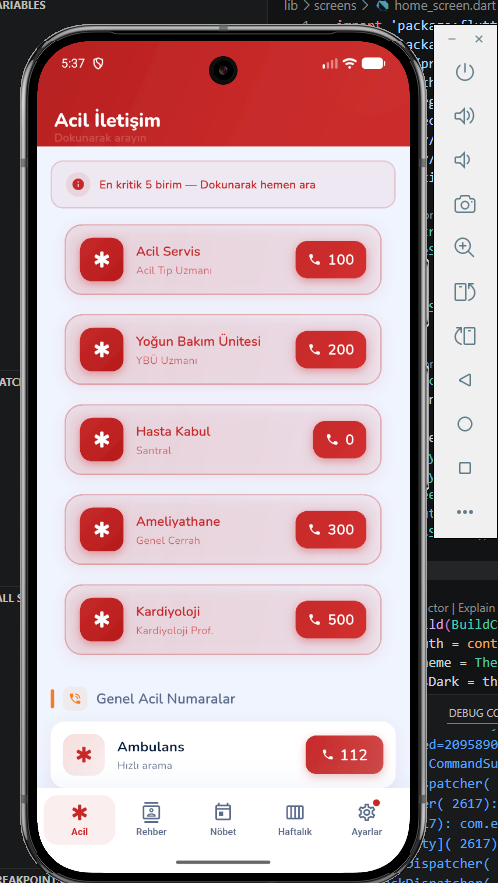
Acil durumlarda hızlı erişim için tasarlanmıştır. Kullanıcılar acil numaralara veya bilgilere buradan ulaşabilir.

---

## 2. Yönetici Ana Ekranı
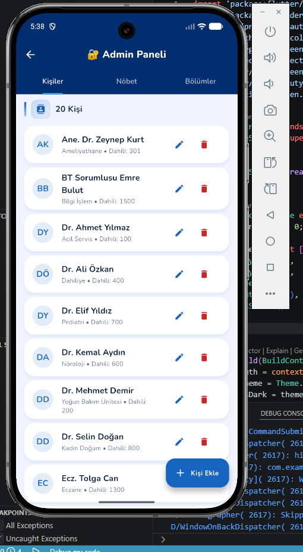
Yöneticiler için özel işlemlerin bulunduğu ana paneldir. Kullanıcı ve sistem yönetimi işlemleri yapılabilir.

---

## 3. Yönetici Bölüm Yönetimi

Yöneticiler bölümleri ekleyip düzenleyebilir. Bölüm bazlı yetkilendirme ve düzenleme işlemleri yapılır.

---

## 4. Yönetici Nöbet Yönetimi
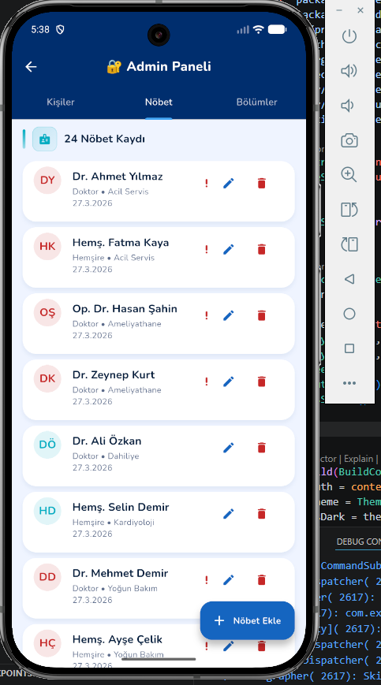
Nöbet listelerini oluşturma ve düzenleme ekranıdır. Yöneticiler nöbetleri atayabilir ve güncelleyebilir.

---

## 5. Ayarlar Ekranı
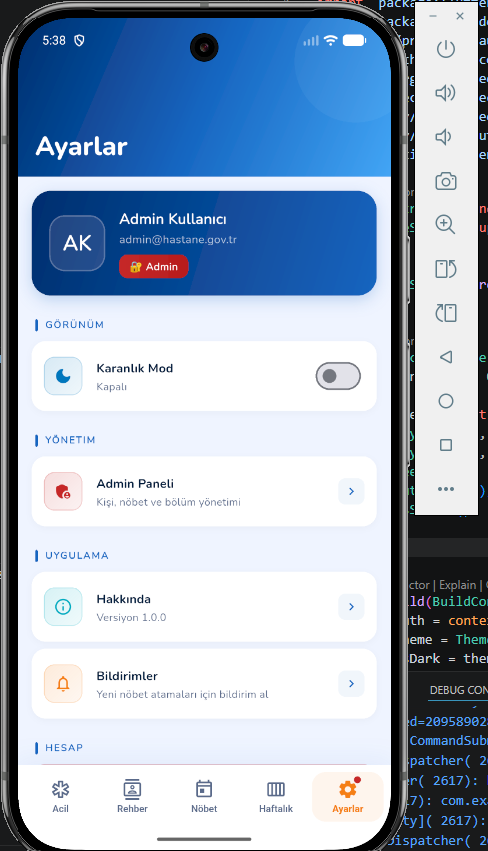
Uygulama ayarlarının yapıldığı ekrandır. Tema, bildirim ve hesap ayarları gibi seçenekler bulunur.

---

## 6. Bölüm Düzenleme Ekranı
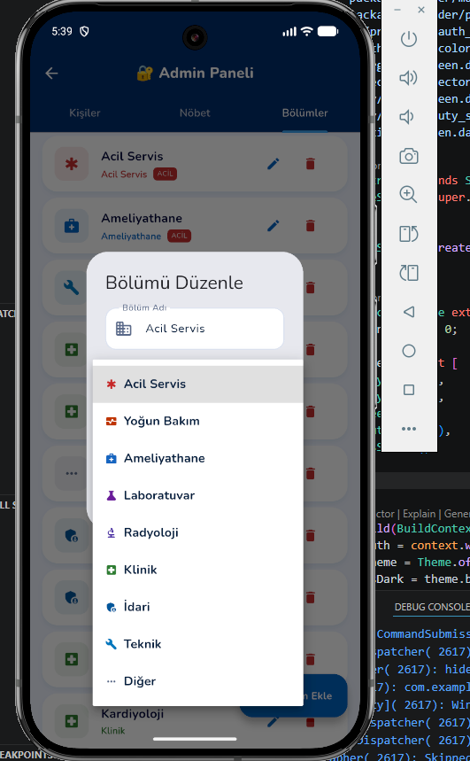
Mevcut bölümlerin düzenlenebildiği ekrandır. Bölüm adı, açıklaması gibi bilgiler güncellenebilir.

---

## 7. Haftalık Nöbet Ekranı
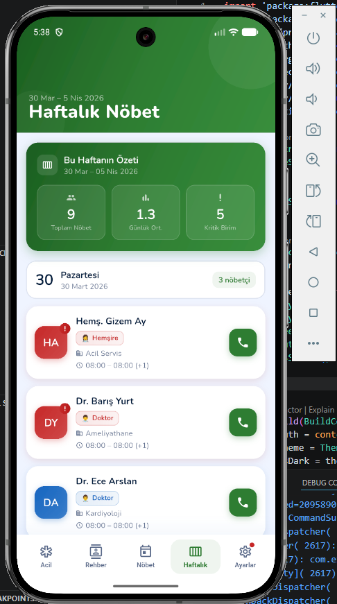
Haftalık nöbet çizelgesinin görüntülendiği ekrandır. Kullanıcılar kendi nöbetlerini burada görebilir.

---

## 8. Karanlık Tema Ekranı
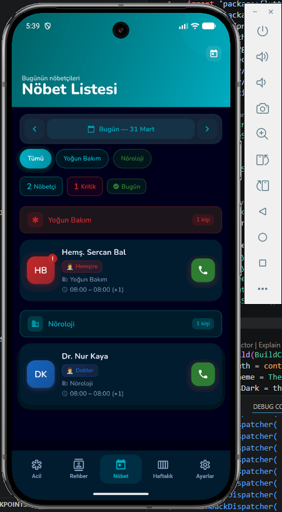
Uygulamanın karanlık tema görünümünü gösterir. Kullanıcılar tema tercihini buradan değiştirebilir.

---

## 9. Kişi Düzenleme Ekranı
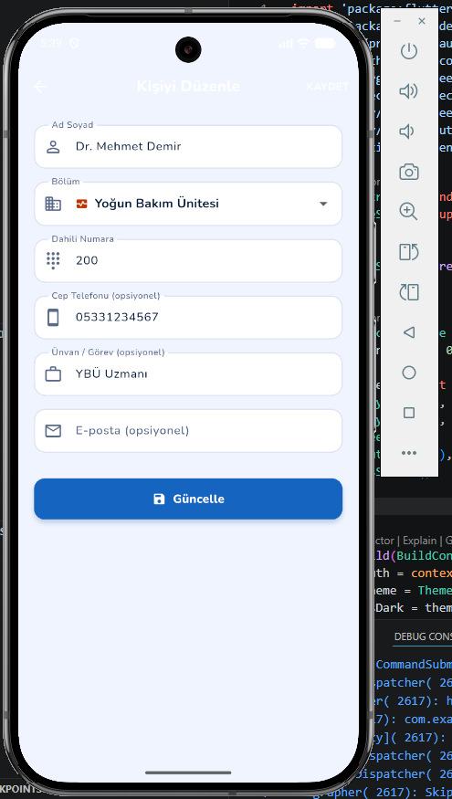
Kullanıcılar kendi veya başkalarının bilgilerini düzenleyebilir. İsim, iletişim bilgileri gibi alanlar güncellenebilir.

---

## 10. Giriş Ekranı
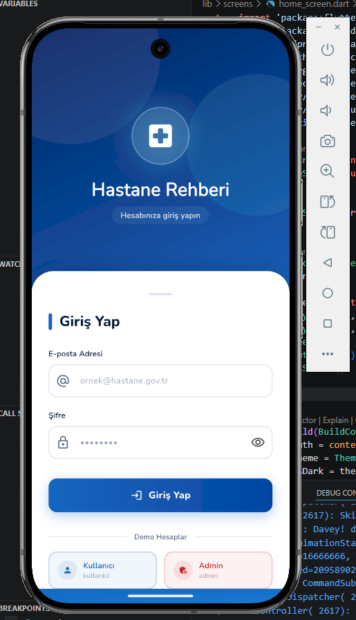
Kullanıcıların uygulamaya giriş yaptığı ekrandır. Kimlik doğrulama işlemleri burada yapılır.

---

## 11. Nöbet Ekranı
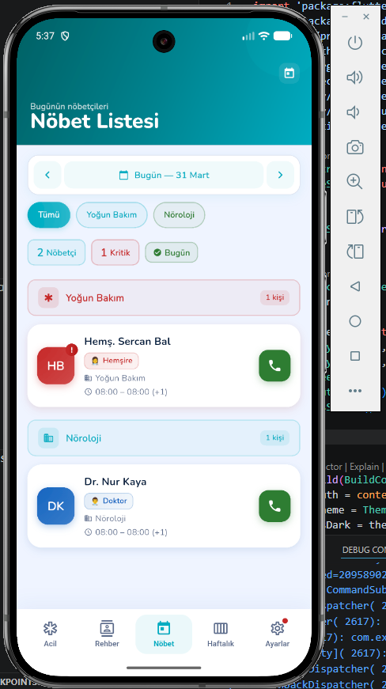
Genel nöbet listesinin görüntülendiği ekrandır. Tüm kullanıcıların nöbetleri burada listelenir.

---

## 12. Nöbet Ekleme Ekranı
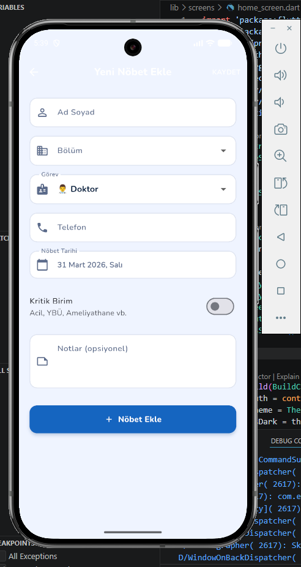
Yeni nöbetlerin eklendiği ekrandır. Kullanıcılar veya yöneticiler yeni nöbet atayabilir.

---

## 13. Rehber Ekranı
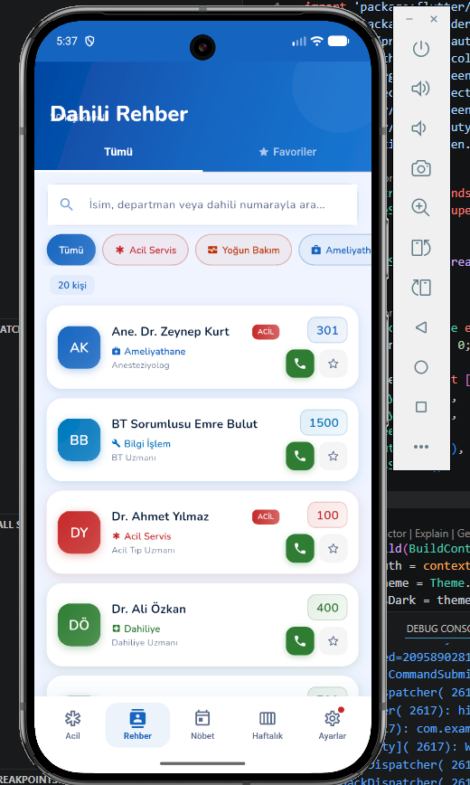
Kullanıcı rehberinin bulunduğu ekrandır. Tüm kullanıcıların iletişim bilgileri burada listelenir.

---

## Proje Kurulumu ve Çalıştırılması
1. Projeyi klonlayın veya indirin.
2. Gerekli Flutter bağımlılıklarını yükleyin:
   ```
   flutter pub get
   ```
3. Uygulamayı başlatın:
   ```
   flutter run
   ```

## Ek Bilgiler
- Ekran görüntüleri `docs/screenshots/` klasöründe yer almaktadır.
- Her ekranın detaylı işlevi için ilgili `.dart` dosyalarını inceleyebilirsiniz.

---

Bu dokümantasyon, uygulamanın ekranlarını ve temel işlevlerini özetlemektedir. Daha fazla bilgi için proje dosyalarını inceleyebilirsiniz.
